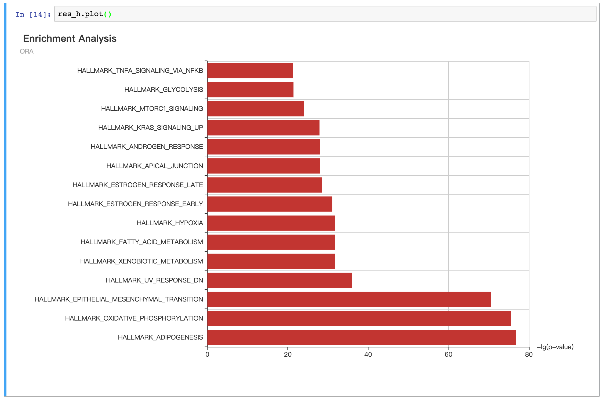

## Enrichment Analysis

### Overview
Enrichment analysis aim to find functional set which are over-represented in 
a large set of protein or genes. In this section, we will go through the supports
enrichment, demonstrate the definition and the usage of each method. 

### Basic class
This basic class of enrichment analysis is `EnrichmentResult` it self contains the 
 result of certain type of enrichment analysis and subclass should at least
 rewrite the statistic method `run` to perform the analysis.
 
#### methods
* `run` : execute the enrichment analysis and return the instance of subclass contains
the analysis information

* `table` : return the result pandas.Dataframe

* `plot` : plot the bar chart in the output area

* `graph` : if the result set have certain relationship, this method return the graph of them.
for example, the Gene Ontology ORA subclass return the graph of GO DAG of significant sets.

### ORA
The over-representation analysis is the most widely used enrichment analysis method, It use
Fisher's exact test to check whether certain functional set is over-represented in a large set
of protein or genes.

#### Implementation
The ORA methods is implemented in the analysis.ora
```python
# general ora method
ORA.run(study, pop, gene_set, adjust='fdr_bh')    
```
where `study` is set of significant differential expressed genes or proteins,
 and `pop` is the total annotated genes or proteins. the `gene_set` is a dict contains
the gene set name and contained genes like 
```
{"B cell receptor pathway": {"CD22", "CD81"...}...}
```
#### Example
```python
# import necessary module
from pypathway.analysis.ora import KEGG, ORA
from pypathway.utils import ColorectalCancer, IdMapping, GMTUtils

# load a gene_set from a gmt file
gmt = GMTUtils.parse_gmt_file("../../tests/gmt_file/h.all.v6.0.entrez.gmt")

# load data set
c = ColorectalCancer()

# perform general ORA test
res_h = ORA.run(c.deg_list, c.background, gmt)

# view result table
res_h.table.head()
```
The result table (In IPython notebook):

<table border="1" class="dataframe">
  <thead>
    <tr style="text-align: right;">
      <th></th>
      <th>name</th>
      <th>mapped</th>
      <th>number in study</th>
      <th>p-value</th>
      <th>fdr</th>
    </tr>
  </thead>
  <tbody>
    <tr>
      <th>0</th>
      <td>HALLMARK_GLYCOLYSIS</td>
      <td>184</td>
      <td>91</td>
      <td>9.956407e-08</td>
      <td>3.555860e-07</td>
    </tr>
    <tr>
      <th>1</th>
      <td>HALLMARK_APICAL_JUNCTION</td>
      <td>185</td>
      <td>97</td>
      <td>7.750142e-10</td>
      <td>3.748583e-09</td>
    </tr>
    <tr>
      <th>2</th>
      <td>HALLMARK_MYC_TARGETS_V1</td>
      <td>173</td>
      <td>48</td>
      <td>8.377692e-01</td>
      <td>9.106187e-01</td>
    </tr>
    <tr>
      <th>3</th>
      <td>HALLMARK_COAGULATION</td>
      <td>131</td>
      <td>64</td>
      <td>1.237516e-05</td>
      <td>3.093790e-05</td>
    </tr>
    <tr>
      <th>4</th>
      <td>HALLMARK_MTORC1_SIGNALING</td>
      <td>176</td>
      <td>90</td>
      <td>1.551015e-08</td>
      <td>5.965443e-08</td>
    </tr>
  </tbody>
</table>

```python
# barplot
res_h.plot()
```


### Specific ORA
For KEGG, REACTOME and GO, there are specific class implement for them. For the convienice of geneset query and 

* `KEGG` 
```python
# rather than input specific gene set, organism is accepted and geneset will be retrieved.
r_kg = KEGG.run(c.deg_list, c.background, 'hsa')
```

* `Reactome`
```
# Reactome official API is used. note that the background is the whole Reactome
# library, if background set required, use Reactome GMT file and ORA class 
r = Reactome.run(sybs, organism='Homo sapiens')
```

* `Gene Ontology`
```python
# Gene ontology analysis require additional a assoc file.
# IdMapping class could be used to generate this file
# c.background is to background gene list of certain study
r = IdMapping.convert_to_dict(input_id=c.background, source='ENTREZID', target="GO", organism='hsa')
# and run the analysis
# [str(x) for x in c.deg_list]: study
# [str(x) for x in c.background]: background
# r: the assoc dict
# obo=path + 'go-basic.obo': the path to the obo file
rg = GO.run([str(x) for x in c.deg_list], [str(x) for x in c.background], r, obo=path + 'go-basic.obo')
```

The gene ontology enrichment analysis provide the graph overview of the analysis


### GSEA
The Gene Set Enrichment Analysis, is introduced in paper:
> Gene set enrichment analysis: A knowledge-based approach for interpreting genome-wide expression profiles

at [PNAS](http://www.pnas.org/content/102/43/15545.short)

This class is implement via [GSEApy](https://github.com/BioNinja/GSEApy)

#### Usage

```python
# gene_exp is the expression dataframe
# class_vector is the define of the experiment
gs_res = gp.gsea(data=gene_exp, gene_sets='KEGG_2016', cls=class_vector, 
                 permutation_type='phenotype', #set permutation_type to phenotype when 
                 outdir='gsea_reprot', method='signal_to_noise', format='png')
```
more detail information is described in the `example/analysis/GSEA.ipynb`

### SPIA

The Signaling Pathway Impact Analysis, is introduced in paper:
> [A novel signaling pathway impact analysis](https://academic.oup.com/bioinformatics/article/25/1/75/302846/A-novel-signaling-pathway-impact-analysis#)

we implement this algorithm in Python.

#### Usage

```python
r = SPIA.run(de=c.deg, all=c.background)
# de: a dict, key: gene, value: fold-change
# the idtype is entrez. use IDMapping to convert
```

### Enrichnet

The Enrichnet algorithm is introduced in paper
> [EnrichNet: network-based gene set enrichment analysis](https://academic.oup.com/bioinformatics/article/28/18/i451/247049/EnrichNet-network-based-gene-set-enrichment)

we implement the Python API for Enrichnet HTTP service.

#### Usage

```python
run(genesets, idtype='hgnc_symbol', pathdb='kegg', graph='string')
# genesets: the gene list used to run the analysis
# idtype: input id type
# the pathlib: function set library
# graph: the graph 
```

